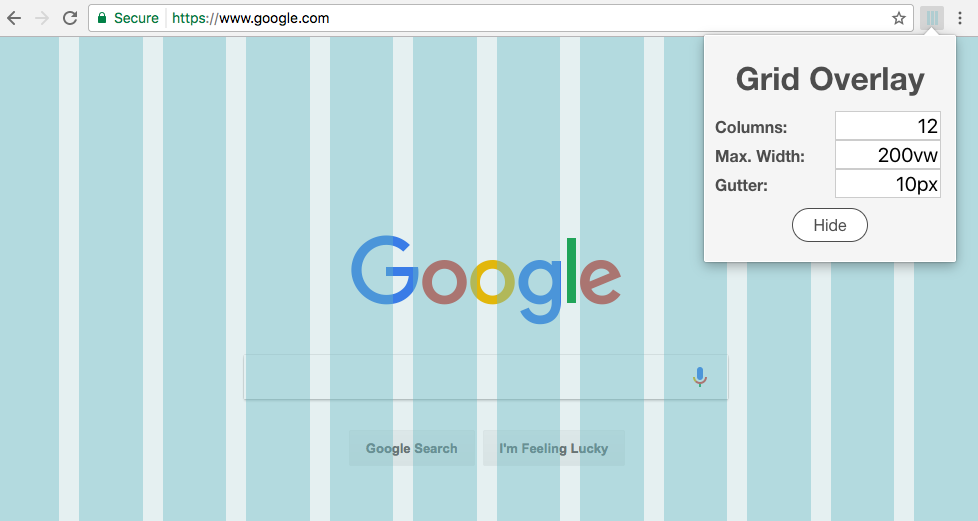

# Grid Overlay

Chrome extension for a grid overlay ([Chrome Store](https://chrome.google.com/webstore/detail/grid-overlay/ajpdcgikmhhndacipnncaalkbeadgjfd)).

## Features

* Toggle grid overlay
* Shows grid after page-reload
* Define number of grid columns
* Define maximum width of grid
* Define width of gutter
* On the fly grid update on changes (columns, max. width, gutter)